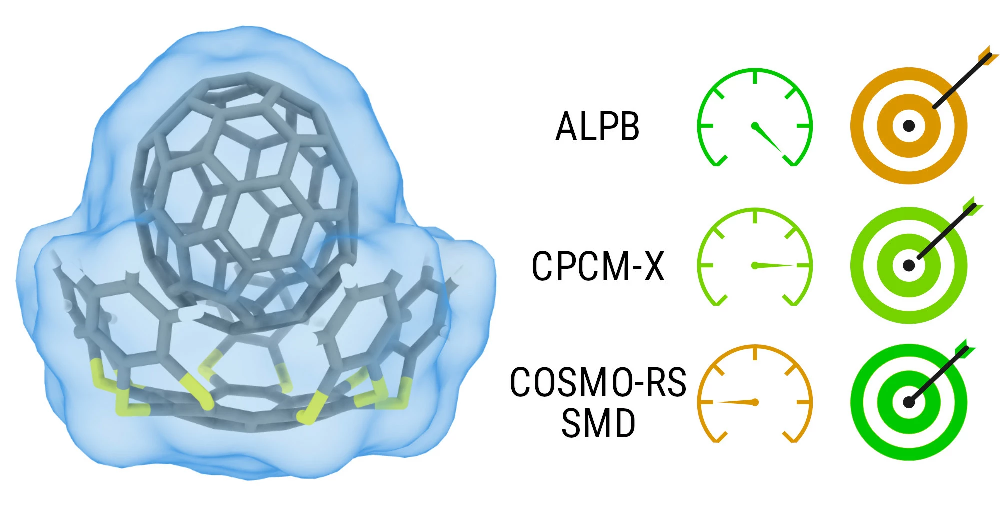

# CPCM-X

## Introduction

<div align="center">

</div>

This is an fully open source solvation model, based on the original 
conductor like screening model for realistic solvation (COSMO-RS) model by Klamt et al. in combination with the
universal solvation model based on solute electron density (SMD) by Marenich, Cramer and Truhlar.

While there are also parameters in this repository, that are optimized for running this library with ORCA and TURBOMOLE, the published version of this model was built to be run with the semi-empirical [GFN2-xTB](https://github.com/grimme-lab/xtb) method. However, the final goal of this project is to deliver a robust open-source solvation framework, which can be reparametrized for the method of choice. 

You can find the publication [here](XXX).

## Using CPCM-X as a library

CPCM-X is built to be used as a library in Fortran projects. To be able to use this project, as a library, a few steps have to be taken beforehand. In this section, you will find an example implementation of CPCM-X, based on our implementation into the xTB source code.

First, we created a new module and load the necessary components from the CPCM-X source code. We also setup a new type (``Tcpcmx``) and extend the original calculation type provided by CPCM-X with a few additional procedures.


```fortran
module xtb_solv_cpx
    use cpx, only: calculation_type, parameter_type, atomicmass, density,&
    &initialize_param,load_solvent,read_cosmo
    use xtb_solv_cosmo, only: TCosmo
    use iso_fortran_env, only: input_unit, output_unit
    use mctc_env, only: error_type, fatal_error, wp
    implicit none

    type, extends(calculation_type) :: TCpcmx
        contains

        procedure :: setup => setup_cpcmx
        procedure :: calc_solv => calculate_cpcmx
        procedure :: print => print
    end type Tcpcmx

    contains
```
In the setup procedure, we setup the right parametrisation for our method (``xTB``), and load the specified solvent from an internal database. If you would use this with an unknown or new method, you would need to load the solvent using the ``read_cosmo`` routine (same as the solute). Next, the solute is loaded from the ``xtb.cosmo`` file created by xTB.
```fortran
subroutine setup_cpcmx(self, solvent)
   implicit none
   !> CPCM-X Calculation type
   class(Tcpcmx), intent(inout) :: self
   !> Solvent for internal parameter loading
   character(len=*), intent(in) :: solvent
   !> Error handling
   type(error_type), allocatable :: error

   !> Initialize the CPCM-X parametrisation from the internal xtb database.
   call initialize_param('xtb',solvent,self,error)

   !> Load a solvent from the internal xTB solvent database (you could also use read_cosmo for the solvent)
   call load_solvent(solvent,self%solvent,error)

   !> Load the solute from a .cosmo file
   Call read_cosmo('xtb.cosmo',self%solute,'NONE',error)

   !> Error handling
   if (allocated(error)) Call raise('E',error%message)
end subroutine setup_cpcmx
```
Now, the interesting part begins: The calculation of the various parts of the solvation free energy. We setup the necessary prerequisites (like probe radius and temperature) and average the charges. Afterwards we determine the bonding situation (e.g. for the ring correction) and calculate the restoring free energy, the state correction and the ``CDS`` part of the solvation free energy.
```fortran
subroutine calculate_cpcmx(self,solvent,probe,T,max_cycle,conv_crit)
   implicit none
   !> CPCM-X calculation type
   class(Tcpcmx), intent(inout) :: self

   !> Name of the solvent for property loading
   character(len=*), intent(in) :: solvent

   !> Error handling
   type(error_type), allocatable :: error

   !> Probe Radius for SASA Term, Temperature and convergence criteria for COSMO-RS part
   real(wp), intent(in) :: probe
   real(wp), intent(in) :: T
   integer, intent(in) :: max_cycle
   real(wp), intent(in) :: conv_crit

   !> Charge averaging
   call self%average_charge(error)

   !> Bonding determination
   call self%init_bonding()

   !> restoring free energy
   call self%solv('crs',error,T,max_cycle,conv_crit)
   !> Error handling
   if (allocated(error)) Call raise('E',error%message)

   !> State correction
   call self%state_correction(density(solvent),atomicmass(self%solvent%element),T)
   !> SMD-CDS part
   call self%cds(probe,solvent)
end subroutine calculate_cpcmx
```
All necessary components of the solvation free energy, as well as the solvation free energy itself should then be saved in the calculation type.
You should be able to print it, for example like this:
```fortran
subroutine print(self)
   implicit none
   class(Tcpcmx), intent(in) :: self

   real(wp), parameter :: autokcal=627.509_wp


   write(output_unit,'(4x,a)') repeat('-',73)
   write(output_unit,'(5x,a,t55,a,t66,a)') &
      "Free Energy contributions:", "[Eh]", " [kcal/mol]"
   write(output_unit,'(5x,a,t50,E13.5,t65,F10.5)') &
      "Ideal State (dG_is):", self%dG_is, self%dG_is*autokcal, &
      "Averaging correction (dG_av):", self%dG_cc, self%dG_cc*autokcal, &
      "restoring free energy (dG_res):", self%dG_res, self%dG_res*autokcal, &
      "SMD Contribution (dG_CDS):", self%dG_smd, self%dG_smd*autokcal, &
      "Standard state correction (dG_corr):", self%dG_ss, self%dG_ss*autokcal, &
      "Systematic empirical shift (dG_shift)", self%dG_shift, self%dG_shift*autokcal
   write(output_unit,'(4x,a)') repeat('-',73)
   write(output_unit,'(5x,a,t50,E13.5,t65,F10.5)') &
      "solvation free energy: ", self%dG(), self%dG()*autokcal
   write(output_unit,*) ""
end subroutine print
end module xtb_solv_cpx
```

## Building
You can also use a release binary, but for compatibility, it is recommended to build this project by yourself from source. 
To do that, you need to clone the repository to your local environment.
```
git clone https://github.com/grimme-lab/CPCM-X.git
cd CPCM-X
```
The recommended version for building this project is using Meson.

### Building with Meson
You can also use Meson to build your project. To be able to do that, you need version 0.60 or newer.
To use the default backend, you also need ninja in version 1.7 or newer.
```
meson setup build --buildtype release
ninja -C build
```
You afterwards have to manually install the created binary in the path of your choice.

### Building with Fortran Package Manager
You can also use the [Fortran Package Manager](https://github.com/fortran-lang/fpm) to build this project. Building should be as simple as using
```
fpm build
```

You can also include this project as dependency in your package manifest ``fpm.toml`` as
```
[dependencies]
cpx.git = "https://github.com/grimme-lab/CPCM-X"
```

## Usage of the standalone
You can either use a commandline version of ``CPCM-X`` or create a detailed input for your calculation.

### Using the commandline version (recommended)
To use the commandline version of ``CPCM-X``, you have to set up an ``CPXHOME`` environment variable.
```
export CPXHOME=[path]
```
In the home directory, you need to place a configuration file, as well as the parameters and the ``COSMO`` file database.
If you clone the repository, the commandline version should work out of the box, if you set the ``CPXHOME`` Variable to the cloned repository.
Otherwise, you can create a new sample configuration file and set up the home directory for yourself.
```
cpx --newconfig
```
The commandline version needs a ``coord`` file for your solute and a working version of ``xTB`` or another supported QC package.
You can then start a calculation (starting from the coord file) for example by
```
cpx --solvent water
```

### Using a detailed input
You can also set up an input file. ``CPCM-X`` needs cosmo files for the solute and the solvent. You can create a sample input by
```
cpx --newinput
```
You then need to manually specify which parameters you want to use, as well as the respective cosmo files. You can start the calculation by
```
cpx cpx.input
```
